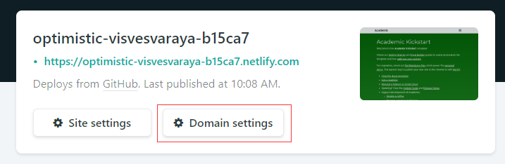

## 搭建博客 ( freenom + github + netlify + hugo ( extended version ) )

1. 安装go、[hugo ( extended version )](https://gohugo.io/getting-started/installing)

2. [freenom](http://freenom.com)申请域名

3. github帐户登录[netlify](https://www.netlify.com/)

4. 选择[主题](https://themes.gohugo.io/)，如Academic
    [Install Academic with netlify](https://sourcethemes.com/academic/docs/install/#install-with-web-browser)，点击connect to github，键入博客仓库名，点击Domain Settings，添加域名

5. 初始化主题

    在博客根目录下 `git submodule update --init --recursive`

6. 配置Nameservers

    打开[freenom](http://freenom.com)，依次点击Services-My Domains-Manage Domains-Management Tools-Nameservers，按以下填入:

    - dns1.p05.nsone.net
    - dns2.p05.nsone.net
    - dns3.p05.nsone.net
    - dns4.p05.nsone.net
    - dns5.p05.nsone.net

7. 创建第一篇博客

    本地博客根目录下打开 `cmd`, 键入 `hugo new post/FirstBlog.md` , 在生成的 `hugo_blog\academic-kickstart\content\post\FirstBlog.md` 中编写blog

8. 修改根目录下 `netlify.toml` 的 `HUGO_VERSION` ( 否则netlify无法自动deploy )

9. 将项目上传至github,可使用两种方式:

    - 命令行
    - GUI

10. 在netlify中查看deploy status

    - 若为published,则可以通过域名访问
    - 若为failed,则需要检查deploy log

ps:

1. windows下推荐使用cmder替代cmd
2. 可在readme中添加查看netlify ( 位置: `settings/general#status-badges` )的deploy stastus的代码

ref:

1. https://www.youtube.com/watch?v=z4HyaQryLCw
2. https://sourcethemes.com/academic/docs/install/
3. https://github.com/gcushen/hugo-academic
4. https://gohugo.io/commands/hugo_server/
5. https://sourcethemes.com/academic/docs/managing-content/
6. https://skyao.io/learning-hugo/installation/quickstart.html ( 主题好看, 但是没有跑成功, 以后再折腾 )

